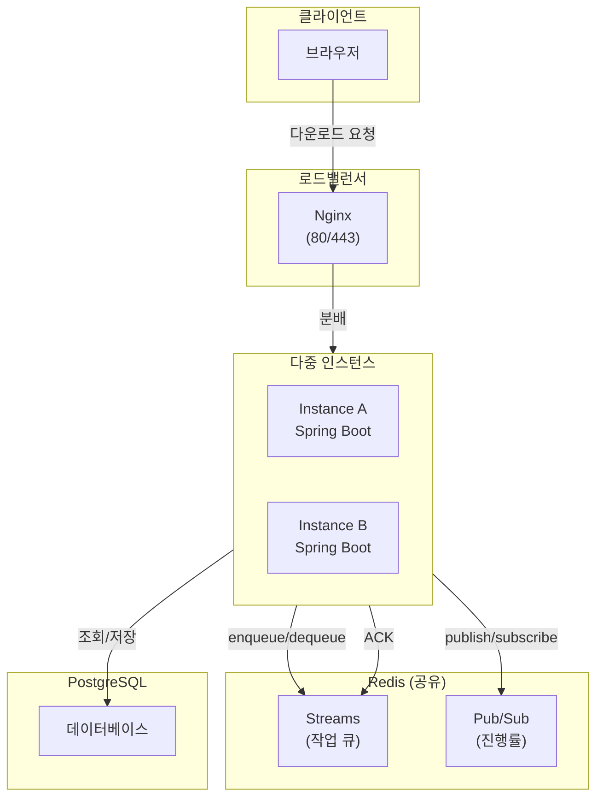

# 대용량 엑셀 다운로드 성능 및 동시 요청 안정성 개선 포트폴리오

> **실무에서 발생한 OOM 문제** 해결 경험을 기반으로, **동시성 제어·전용 스레드풀·분산 큐 설계**를 통해 대용량 엑셀 다운로드의 **안정성**과 **처리 속도**를 개선한 프로젝트

📎 [GitHub Repository](https://github.com/ji1007k/sb-excel-optimizer)

---

## 프로젝트 개요

실무에서 대용량 엑셀 다운로드(약 10만 행) 요청 시 메모리 부족으로 OutOfMemoryError가 발생했습니다.  

GC 튜닝과 SXSSF 스트리밍 및 페이징을 적용해 메모리 문제는 해결했지만,  
엑셀 다운로드 요청 폭증 시 장시간 점유로 인해 스레드풀이 고갈되면 전체 시스템이 영향을 받을 수 있다고 판단했습니다.

이를 방지하기 위해 비동기 처리와 작업 큐를 도입하여 동시 요청 수를 제어했고,  
Redis Streams 기반의 분산 큐 아키텍처로 확장하여 안정성과 확장성을 확보했습니다.

### 핵심 개선
- **동시성 제어**를 통한 시스템 안정성 확보
- **전용 스레드풀**로 Tomcat 스레드풀과 분리하여 스레드 고갈 방지
- **확장 가능한 아키텍처** 기반 마련

---

## 기술 스택

**Backend** | Java 17, Spring Boot 3 (Data JPA, WebSocket, Scheduler)  
**Database** | PostgreSQL 15  
**Cache & Queue** | Redis 7 (Streams, Pub/Sub)  
**Excel Library** | Apache POI (SXSSF)  
**Infra** | Docker, Nginx

---

## 주요 성과 (10만 행 기준)

- 메모리 97.8% 절감 (832MB → 18MB)
- 처리량 10배 향상 (3.0개/분 → 32.3개/분)
- GC 시간 93% 단축 (1200ms → 80ms)

**테스트 환경**: JDK 17 (G1GC) / 8vCPU / 16GB RAM / PostgreSQL 15

📎 [상세 성능 측정 결과 바로가기](./docs/performance-test-results.md)

---

## 개선 과정 요약

### 1차: OOM 해결 (실무)
- **문제**: XSSF로 인한 메모리 부족
- **해결**: SXSSF 스트리밍 + 페이징 + CMS GC
- **결과**: OOM 해결
- **한계**: 동시 요청 폭증 시 스레드풀 고갈

### 2차: 동시성 제어 (포트폴리오)
- **문제**: 요청 폭증 시 모든 스레드가 다운로드 작업에 묶임 → 전체 시스템 마비
- **해결**: 비동기 처리 + BlockingQueue + 전용 스레드풀 + 커서 페이징 + WebSocket 알림
- **결과**: 처리량 약 10배 향상, 시스템 안정성 확보

### 3차: SXSSF 임시 파일 관리 (포트폴리오)
- **문제**: 서버 비정상 종료 시 임시 파일 누적으로 디스크 공간 부족
- **해결**: 스케줄러 기반 정리 + `try-with-resources`
- **결과**: 디스크 안정성 확보

### 4차: 라이브러리 성능 검증 (포트폴리오)
- FastExcel, EasyExcel, SXSSF 비교 (50만 행 기준)
- **결과**: 유의미한 차이 없어 SXSSF 유지

📎 [라이브러리 비교 결과 바로가기](./docs/library-performance-analysis.md)

### 5차: 분산 큐 시스템 (포트폴리오)
- **문제**: 단일 서버 한계 (작업 손실, 분배 불가)
- **해결**: Redis Streams + Consumer Group + 재시도 처리
- **결과**: 스케일아웃 가능한 안정적 분산 구조

### 6차: 분산 환경 메시지 라우팅 (포트폴리오)
- **문제**: 작업 처리 서버 ≠ WebSocket 연결 서버 → 알림 누락
- **해결**: Redis Pub/Sub으로 모든 서버에 브로드캐스트
- **결과**: 수평 확장 및 이벤트 전달 일관성 확보

---

## 아키텍처

---

## 향후 개선 계획

### 단기
- [ ] Event-Driven 방식으로 1초 스케줄러 폴링 제거
- [ ] XAUTOCLAIM 기반 자동 복구로 장애 인스턴스 작업 자동 회수

### 장기
- [ ] 엑셀 다운로드 코어풀사이즈 동적 설정 (CPU 사용률, Heap 메모리 기반)
- [ ] S3 파일 스토리지 도입으로 다중 인스턴스 파일 접근 통합

---